# How to Train Really Large Models on Many GPUs?
这篇是lilian weng的博客阅读笔记https://lilianweng.github.io/posts/2021-09-25-train-large/
## Overview

上方每个颜色代表一个独特的权重矩阵，下方每个颜色代表一个独特的token集
## Training Parallelism
### Data Parallelism数据并行
- 把权重复制到多个机器，把数据分块给不同机器
- 如果模型参数比单个GPU的内存要大，那么使用一些方法如**GeePS**，将不被使用的参数暂时返回CPU
- 在每一轮过后，同步梯度或权重，有两种主要方式
  - Bulk synchronous parallels (BSP)
    在每一轮过后同步参数，但是每个机器必须等待同步
  - Asynchronous parallel (ASP)
    每个机器异步处理数据
  - 折中方法
    - gradiant accumulation
        每x轮同步一次
    - bucketing gradients
     DDP 把多个层的梯度打包成一个“桶”（Bucket）。只有当这一个桶里的所有梯度都计算完成后，才发起一次大的 AllReduce。
    - Computation and communication scheduling optimization
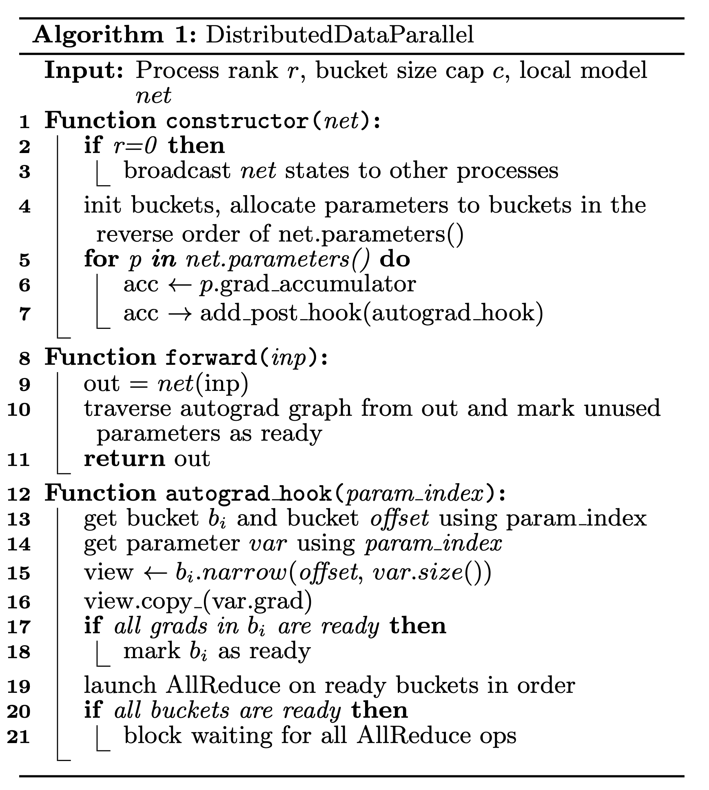

### Model Parallelism模型并行
- 当模型权重不能放入单个节点的时候，就要进行模型并行。把模型分块放到不同工作机器上
- 几个连续的层组成一组，放到一个工作机器上
- 顺序执行会造成很长的等待时间
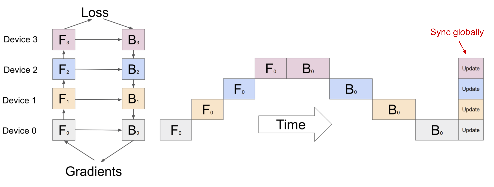
  
### Pipeline Parallelism流水线并行
- 结合MP和DP来减少时间空当
- 把每个minibatch划分成microbatch，让每个工作机器同时处理一个小batch
- 每个barch需要前向和后向传播，只传播前向激活值和后向梯度
- **GPipe**([Huang et al. 2019](https://arxiv.org/abs/1811.06965))
  - 每个microbatch的梯度在最后被同步聚合，空当仍然存在，但很小
  - m个microbatch和d个划分，那么时间为
  $$1-\frac{2md}{(2m+2(d-1))d}=\frac{d-1}{m+d-1}$$
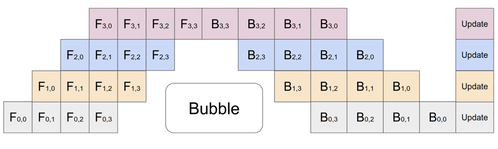
- **PipeDream** ([Narayanan et al. 2019](https://people.eecs.berkeley.edu/~matei/papers/2019/sosp_pipedream.pdf))
  - 预估：先预估显存和执行时间，使用动态规划来决定每个GPU所执行的层
  - 1F1B
    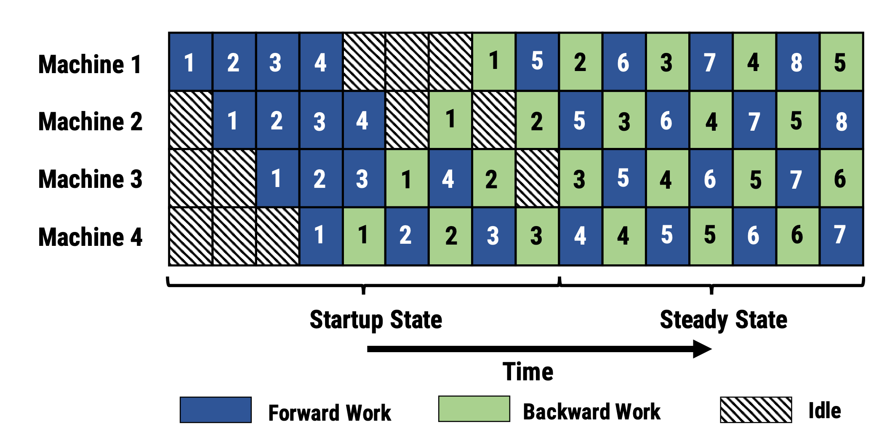
    - 每一个microbatch的前向和后向转播会使用不同的模型权重，所以提出了两个方法
      - Weight stashing：每个机器记录几个版本并确保在同一个batch里使用的是同样的版本
      - Vertical sync (Optional)：传播的时候还要传播模型版本，下一个机器使用接收到的模型版本处理数据
  - 两个变种
    - **PipeDream-flush**
      - 等每个minibatch也就是所有microbatch完全跑完后更新权重，再进行下一轮，永远只需要保存一个版本的模型数据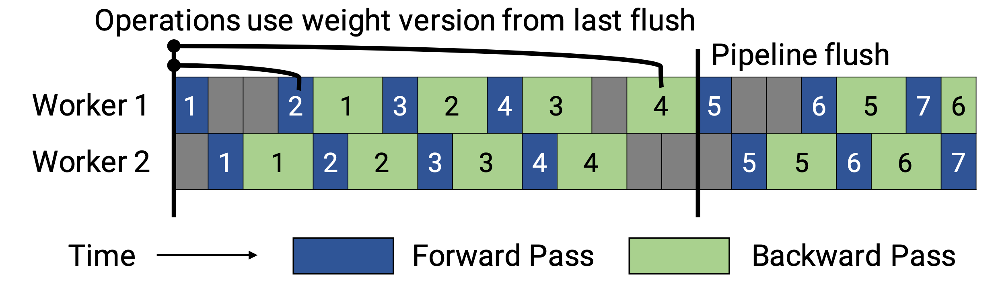
    - **PipeDream-2BW**
      - 保留两个版本的模型数据，每k个microbatch跑完之后更新一轮数据，其中k>d
      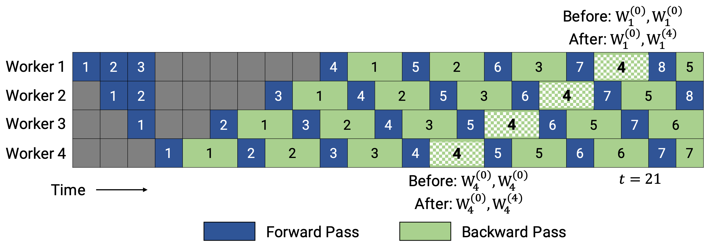

### Tensor Parallelism张量并行
- 前面的是对layer进行垂直切分，而这里是对MLP层进行切分
- **Megatron-LM**
  - Transformer中的MLP包含一个GEMM跟着一个非线性的GeLU，我们可以将权重矩阵A按列分开
    $$A = [A_1, A_2]$$

    $$Y = \text{GeLU}(XA)$$

    $$[Y_1, Y_2] = [\text{GeLU}(XA_1), \text{GeLU}(XA_2)]$$
  - Transformer中的注意力机制也可以拆分
    $$\text{Attention}(X, Q, K, V) = \text{softmax}\left(\frac{(XQ)(XK)^\top}{\sqrt{d_k}}\right)XV$$
    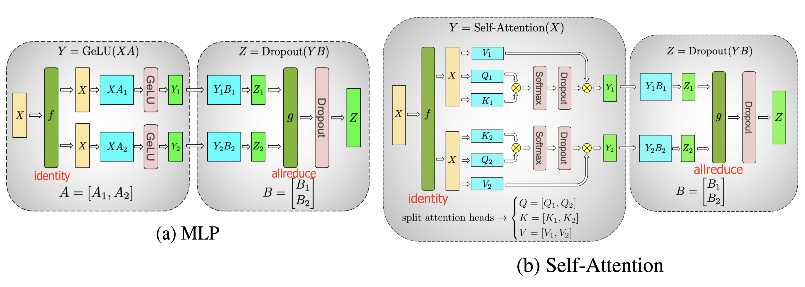
- **PTD-P.**
  - 把流水线，张量，数据并行结合起来了
  - 之前的GPipe是每个GPU负责连续的几层，而现在每个GPU负责不连续的几层，比如GPU1负责1,2,9,10，GPU2负责3,4,11,12
  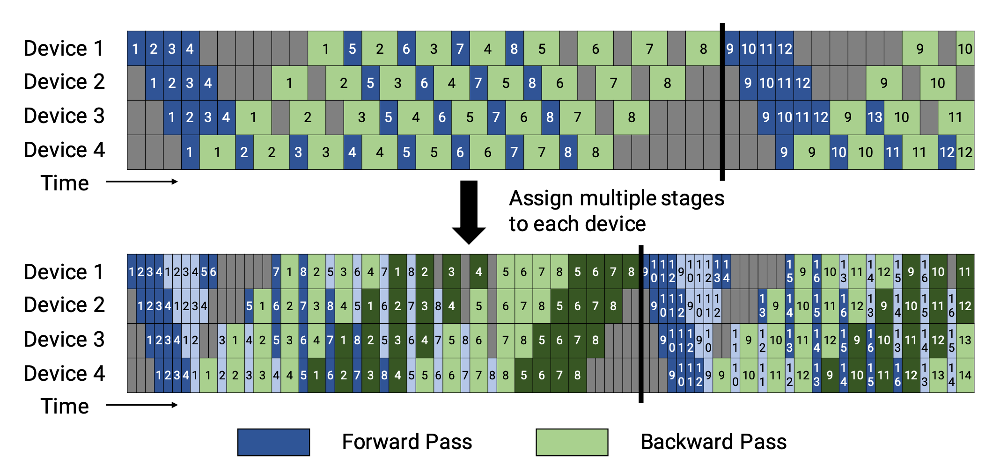
## Mixture-of-Experts (MoE)
- **Mixture-of-Experts (MoE)**
  - 使用门控机制，连接多个专家，决定哪几个专家工作
    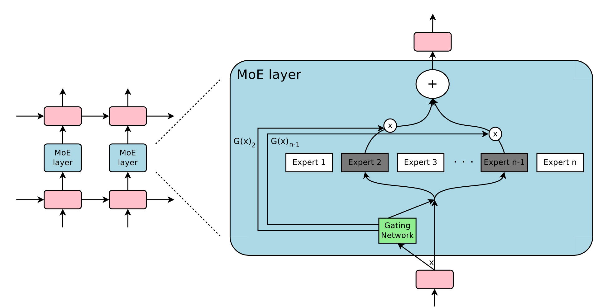
  - MoE层包含
    - n个前馈神经网络$\{E_i\}^n_{i=1}$，每个都是一个专家
    - 一个门控神经网络，学习如何根据输入的数据，计算出一个概率分布，从而将任务分配给少数几个最合适的专家
  - 可以使用两层分级式MoE来优化调度
  - 如何选专家？一个常用的方法是把输入和一个可训练的权重矩阵$G_g$乘起来然后做softmax，但是这会导致每个专家分到一点点分，大家都要干活，没法节省资源。因此MoE只保留top k的专家，并会增加高斯噪声来保证均衡性。这个机制叫做**noisy top-k gating**
   $$G(x) = \text{softmax}(\text{topk}(H(x), k))$$

  $$H^{(i)}(x) = (xW_g)^{(i)} + \epsilon \cdot \text{softplus}((xW_{\text{noise}})^{(i)}); \quad \epsilon \sim \mathcal{N}(0, \mathbf{1})$$

  $$\text{topk}^{(i)}(v, k) = \begin{cases} v^{(i)} & \text{if } v^{(i)} \text{ is in the top } k \text{ elements of } v \\ -\infty & \text{otherwise} \end{cases}$$

  - 为了避免由于自强化效应，门控会一直偏向于一个专家，于是提出了一种软约束
   $$L_{\text{aux}} = w_{\text{aux}} \cdot \text{CV}\left(\sum_{x \in X} G(x)\right)^2$$
   其中CV是变异系数，G(x)是工作量
- **GShard**
  - 用于将MoE模型拓展到超大参数
    - MoE Transformer 每隔一层前馈层就会替换为一个 MoE 层。
    - 只有 MoE 层会在多台机器间进行分片 (Sharding)，而其他层（如注意力层）则在各机器间简单复制。
  - 门控装置的改进
    - **专家容量**：输入一个专家的token有一个阈值成为专家容量，如果token超过了专家容量，会被标记为overflowed并且门控输出全零向量
    - **本地组分发**：将token划分为多个本地组，并将专家容量施加在组级别
    - **随机损失**：加入一个随机损失来最小化分配给各个专家的数据方差
    - **随机路由**：第二好的专家是根据其权重数据随机选择的，从而增加随机性以增加泛化能力
  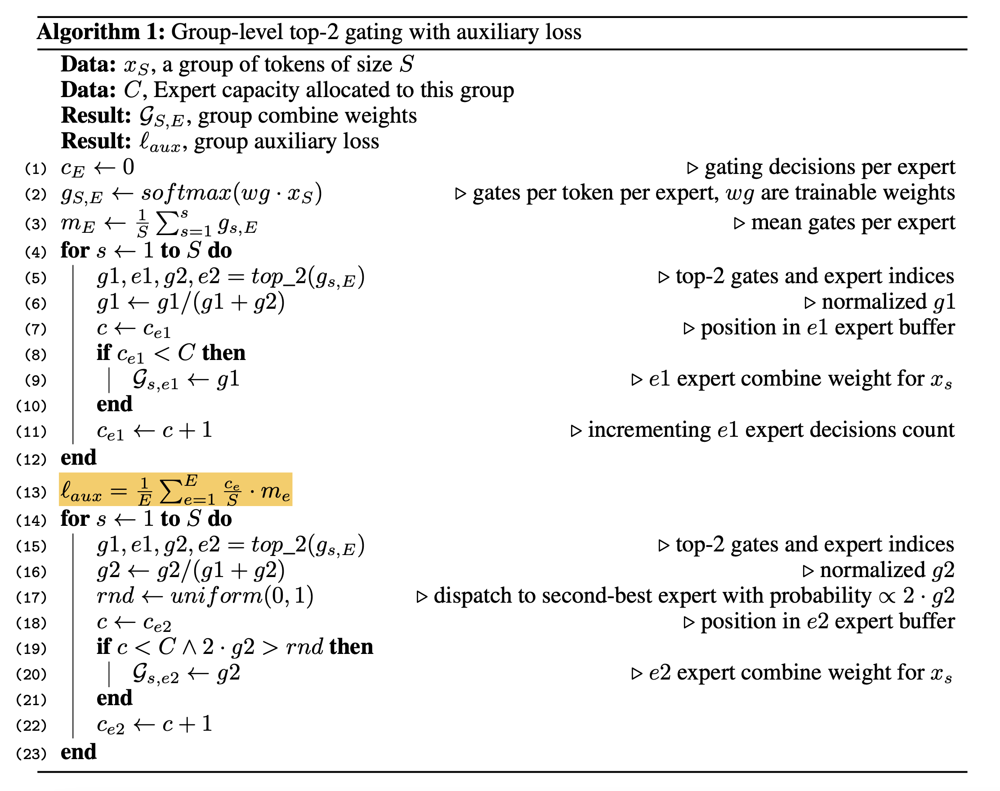
- **Switch Transformer**
  - 拓展到了万亿参数，每个输入只路由到一个专家上
  - 随机损失为$\text{loss}_{\text{aux}} = w_{\text{aux}} \sum_{i=1}^n f_i p_i$，其中fi是实际路由到第i个专家的比例，pi是门控装置预测路由到第i个专家的几率
  - 为了提高训练稳定性，switch Transformer融合了以下几个设计
    - 选择精度：只在路由阶段使用FP32精度，结果重映射到FP16精度
    - 更小的初始化：初始权重矩阵从截断的正态分布中采样，均值 $\mu = 0$，标准差 $\sigma = \sqrt{s/n}$，推荐将初始化缩放参数从1降低到0.1，通过减小初始权重的规模，可以有效抑制训练初期的激活值过大问题，从而提高稳定性。
    - 更高的expert dropout：在小数据集上微调时，很容易过拟合，但是如果简单的增加dropout，性能反而会下降，所以采用差异化的dropout，非专家层保持较小的dropout率，专家层使用较大的dropout率
- **Export Choice(EC)**
  - 反过来，每个专家挑选它的top-k token，这样每个专家自然能满足专家容量，token也被分布到了各个专家上。它有负载均衡并且能够将训练收敛速度提升两倍
  - 计算token和专家的亲和度分数$$S = \text{softmax}(X \cdot W_g)$$
  - $$G, I = \text{top-k}(S^T, k)$$
   
    $$P = \text{one-hot}(I)$$
    其中G是门控矩阵，记录对应的路由权重，I[i,j]记录了第i个专家选择的第j个token，P是I的独热矩阵
  - 为了限制每个专家选中的最大token数目，定义了如下优化问题：
    $$\max_{A} \langle S^\top, A \rangle + \lambda H(A)$$

    $$s.t.\forall i : \sum_{j'} A[i, j'] = k ,\forall j : \sum_{i'} A[i', j] \leq b ,\forall i, j : 0 \leq A[i, j] \leq 1$$
    - 其中A[i, j]表示第i个专家是否选择第j个token
    - $k=nc/e$，其中n是一批中的总token数，c是每个token使用的专家数目。论文主要使用c=2，不过c=1依然比top-1选择法的性能要好。有趣的是，c=0.5只对训练表现有稍微地影响
  - 一个坏处是它不适用于小batch或者自回归生成，因为他需要预知未来的token来选择top-k token

## 其它的显存节约设计
- **CPU Offloading**
  - 当GPU显存满了的时候，可以把它们卸到CPU里面，当需要的时候再载入。不过它会增加训练时间，所以近年来比较少用
- **Activation Recomputation（激活重计算）**
  - 也被称为激活检查点或梯度检查点，它把训练一个$l$层神经网络的显存降低到了$O(\sqrt{l})$，然而每个batch只增加了一次前向计算时间
  - 将一个$l$层的网络划分成$d$个分区，只有分区边界的激活值会被保存。当然，中间的激活值仍是需要的，所以会在反向传播的过程中重新计算。通过激活重计算，训练的内存成本为$$M(\ell) = \underbrace{\max_{i=1,\dots,k} \text{cost-of-one-partition}(i)}_{\text{第 } i \text{ 个分区执行反向传播的成本}} + \underbrace{O(d)}_{\text{存储中间输出的成本}} = O\left(\frac{\ell}{d}\right) + O(d)$$
  
    当 $d = \sqrt{\ell}$ 时，最小内存成本为 $O(\sqrt{\ell})$。
  - 激活重计算技巧可以使内存成本相对于模型大小呈现**亚线性（Sublinear）**增长。
  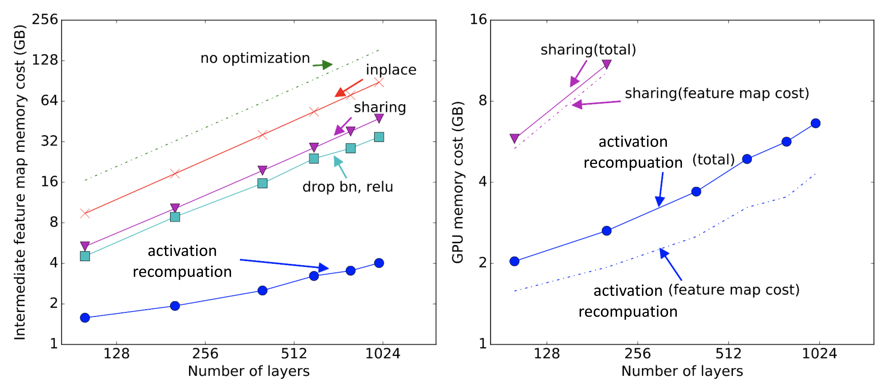
- **Mixed Precision Training（混合精度训练）**
  - 提出了一种使用半精度浮点数（FP16）进行训练并不会降低精度的方法
    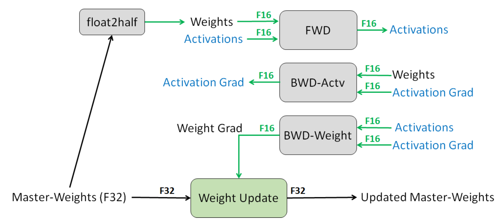
  - 在半精度下不丢失重要信息的三种方法
    - **全精度权重的主副本**：保留一个全精度的模型副本来累加权重，在前向和后向传播的过程中被取整为半精度。动机是每个梯度提升可能会太小，无法在半精度下体现出来
    - **损失缩放**：先把损失放大，可以帮助损失更好地处理小数值梯度，把它们移动到可表示部分的右侧部分（包含更大数值），保留可能会被丢失的数字。对于某些网络不必要（比如图像分类，Faster R-CNN），但对有些网络必要（比如Multibox SSD，LTSM大语言模型）
    - **计算精度**：对于常用的网络计算（比如向量点积，通过对向量元素求和来简化），中间过程用全精度累加，把结果存为半精度。逐点操作可以用全精度也可以用半精度。
- **压缩**
  - 中间结果消耗大量的内存，虽然它只在一次前向和一次后向传播中使用。前向和后向之间有个时间差，于是提出一种在第一次使用后压缩中间结果，然后在反向传播时再解码。
  - 整合了两种方案：
    - 针对特定层的无损编码（Layer-specific lossless encoding）： 重点处理 ReLU-Pool 模式（二值化）和 ReLU-Conv 模式（稀疏存储与密集计算）。
    - 激进的有损编码（Aggressive lossy encoding）： 采用了延迟精度降低（DPR）技术。他们观察到，特征图（Feature maps）的首次即时使用应保持高精度，但在其第二次使用时，可以容忍较低的精度。
  - 实验结果表明，Gist 能将 5 种SOTA图像分类深度神经网络的内存开销平均降低2倍（平均缩减至1.8倍），而性能开销（运行速度损失）仅为4%。
- **内存高效优化器**
  - 优化器需要大量的内存，以Adam为例，它要储存向量和变量，他们的大小和模型还有梯度一样大，也就是说需要存储四倍权重大小
  - **Adafactor**仅追踪移动平均值的逐行和逐列之和，并以此为基础来估算二阶矩
  - **AM3**采用一种自适应参数优化法，也可以大幅减小显存
  - **ZeRO**基于对大模型训练的两种主要显存消耗观察，优化了显存消耗
    - 主要被模型状态占据，包括优化器状态（比如Adam动量和变量），梯度和参数。混合精度训练需要大量的显存，因为优化器保存了一份梯度的全精度副本还有其它的优化器状态
    - 其它的被激活值，临时缓冲区还有碎片化的不可使用空间占用
  - ZeRO结合了ZeRO-DP和ZeRO-R
    - **ZeRO-DP**是一种加强版的数据并行，可以避免模型状态上的简单冗余。他划分了多个数据并行的优化器状态，梯度和参数，通过一个动态传输调度器来最小化传输体量
    - **ZeRO-R**优化了参与状态的内存消耗，采用分区激活值重计算、固定缓冲区大小以及即时内存去碎片化

## 参考文献
[1] Weng, Lilian. (Sep 2021). "How to train really large models on many GPUs?" Lil’Log. [https://lilianweng.github.io/posts/2021-09-25-train-large/](https://lilianweng.github.io/posts/2021-09-25-train-large/).