# Large Transformer Model Inference Optimization
这篇是lilian weng的博客阅读笔记https://lilianweng.github.io/posts/2023-01-10-inference-optimization/.
- 对于大模型推理，为什么如此困难？主要有两个原因
  - 巨大的内存占用：模型参数和中间状态要存在显存里
    - KV cache在decode阶段要存在显存里。如果batch size是512，内容长度是2048，那么KV cache就有3TB，这是三倍的模型大小！
    - 注意力机制的推理消耗与输入长度成平方关系
  - 低的平行度：推理阶段使用的是一种自回归的范式，这使得解码阶段很难并行
## Methods Overview
- 以下三个是模型推理的主要目标
  - 通过使用更少的GPU以及更少的显存来降低内存占用。
  - 通过降低所需的浮点运算次数（FLOPs）来减少目标计算复杂度。
  - 减少推理延迟，跑得更快
- 这有几种降低内存占用，提高速度的方法：
  - **并行策略**：让模型在多个GPU上一起跑，这使得我们能跑动万亿参数的模型
  - **内存卸载**：把不正在使用的数据卸载到CPU上，这可以节约内存，但是会增加延迟
  - **智能批处理策略**: EffectiveTransformer把连续的序列打包在一起，来减少单个批次内的填充
  - **网络压缩技术**: 例如剪枝（Pruning）、量化（Quantization）和蒸馏（Distillation）。一个规模更小的模型—无论是从参数数量还是位宽（Bitwidth）来看都应当占用更少的内存，并且运行速度更快
  - **针对特定目标模型架构的改进**: 许多架构上的调整，特别是针对注意力层的改动，有助于提升 Transformer 的解码速度。
## Distillation（蒸馏）
- Knowledge Distillation是把昂贵的teacher模型转化为student模型，student模型的构造没有特殊要求，但是输出空间尺寸要和teacher模型一样，从而构造一个合适的学习目标
  
- 学生通过distillation loss来模仿老师的行为。一般来说，模型最后都会有一个softmax操作。我们把softmax前的数据记为$z_t, z_s$，分别代表老师和学生。distillation loss使用一个很高的temperature T来最小化$z_t, z_s$的差距。当有正确答案的时候，我们要和监督学习结合。我们可以使用交叉熵等方法让真实标签和学生模型的soft logits之间建立关联。公示如下：
  $$\mathcal{L}_{\mathrm{KD}} = \mathcal{L}_{\mathrm{distll}}(\mathrm{softmax}(\mathbf{z}_t, T), \mathrm{softmax}(\mathbf{z}_s, T)) + \lambda \mathcal{L}_{\mathrm{CE}}(\mathbf{y}, \mathbf{z}_s)$$
  其中$\lambda$是平衡软硬学习目标的系数，$\mathcal{distll}$经常使用KL散度或者交叉熵。

- DistilBERT（Sanh 等人，2019年）是一个早期的成功尝试。它能够在减少 BERT 40% 参数的同时，在微调后的下游任务中保持 BERT 97% 的性能，且运行速度提升了 71%。
DistilBERT 的预训练损失函数由**软蒸馏损失**，**监督训练损失**（即 BERT 中的掩码语言模型损失）和**余弦嵌入损失**（一种特殊的损失，用于对齐教师模型和学生模型之间的隐层向量）组成。
- 蒸馏可以轻松地与量化、剪枝或稀疏化技术相结合。在这些场景中，教师模型通常是原始的全精度、稠密模型，而学生模型则是经过量化、剪枝或修剪以获得更高稀疏度的模型。
## Quantization(量化)
- 主要有两种方法
  - 训练后量化（PTQ）：先训练到收敛，然后权重转化成低精度。这实现成本很低
  - 量化感知训练（QAT）：量化在预训练和微调步骤中施行，QAT可以达到更好的表现，但是需要额外的训练资源以及获得代表性数据。
- 我们要意识到理论与实践是有区别的，比如由于硬件的限制，某些特定的矩阵乘法无法用GPU实现，比如INT4*FP16，因此不是下列的所有方法都能够带来实际上性能的提升。
### Challenges for Transformer Quantization
- 许多有关Transformer的研究都表明一个简单的低精度预训练量化会导致训练效果大打折扣，由于激活值动态异构性很强，并且一个简单的量化策略没法保持容量。
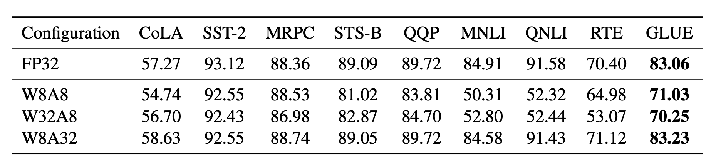
- 当权重是8比特而激活值是32比特时，效果比激活值是8比特要好得多（不论权重是8比特还是32比特）
- Bondarenko 等人在一个小型 BERT 模型中观察到，由于输出张量中存在严重的离群值，前馈网络（FFN）的输入和输出具有截然不同的动态范围。因此，对 FFN 的残差和进行每张量量化（per-tensor quantization）可能会导致显著的误差。
- 当模型大小逐渐增加到数十亿参数，在Transformer的层中逐渐出现了高量级的异常特征，这导致简单的低比特量化失败
- 研究人员在超过6.7B参数的OPT模型中观察到了这样的现象，更大的模型有更多的层，更多的离群值，这样的离群值对于模型表现有重要的影响，激活离群值在一些维度可能是正常值的100倍
 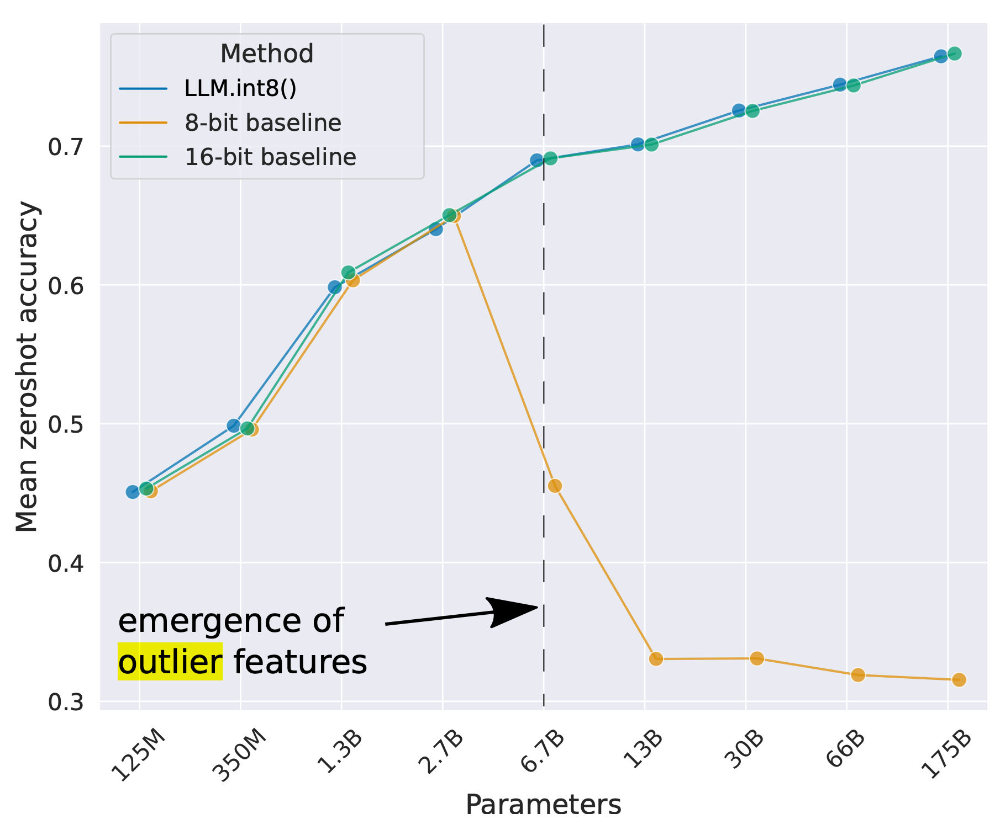
### Post-training quantization (PTQ)(后训练量化)
#### Mixed-precision quantization（混合精度量化）
- 解决上述量化问题的最简单的方法是在不同阶段使用不同的精度。
- GOBO第一个使用了后训练量化，它假设不同层的权重符合高斯分布，然后根据均值和方差得到离群值，对于普通值，把它放到小格子里，只记录格子编号。对于离群值，保留原始值进行计算。
- 实验发现只有特定激活值层的精度影响表现，所以可以只在这些问题层使用FP16，在其它层使用FP8
- LLM.int8()使用了两种混合精度量化方法
  - 由于矩阵乘法是独立的行乘以独立的列，所以每一行和每一列都可以有自己独立的缩放系数，可以通过这一行最大值来进行缩放，缩放到INT8
  - 由于只有一小部分的离群值的数值很大，所以可以把离群值单独拿出来保持FP16，而正常值使用FP8，离群值的判断是依照经验的。

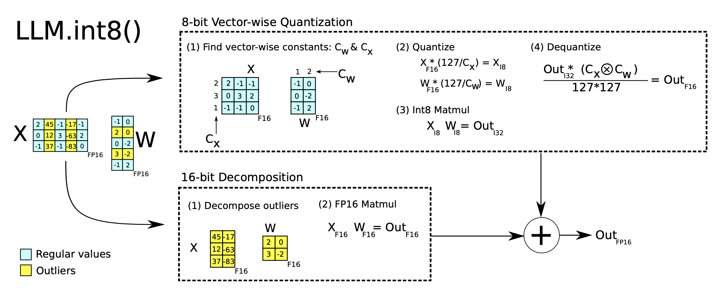

#### Quantization at fine-grained granularity（细颗粒度量化）
- 传统的对每层权重进行统一量化易于实现，但是却没有很好的颗粒度
- Q-BERT将分组量化应用于微调的BERT模型中。它把多头注意力的每个头视为一个一组，使用海森矩阵来进行细颗粒度量化。
- Per-embedding group (PEG)观察到离群值只在隐藏状态维度的小部分层里面出现，Per-embedding计算量太大，所以PEG先根据层的维度大小，把它们分成相同大小的组，然后组内共享量化参数
- ZeroQuant使用和Q-BERT相同的分组量化，并且针对每个token使用不同的量化参数。为了避免精度转换的计算开销，ZeroQuant使用了自定义核，将量化和它的前序步骤进行了算子融合。
#### Second order information for quantization（量化的二阶信息）
- Q-BERT发明了Hessian AWare Quantization(**HAWQ**)来进行混合精度量化。Hessian spectrum更大的层对于量化更加敏感，因此需要更高的精度。这也是判断离群值的一种方法
- 这其实是一个优化问题，给定一个权重矩阵W和一个输入矩阵X，我们希望找到一个矩阵$\hat{W}$使得输出的误差最小。
  $$\hat{\mathbf{W}}^* = \arg \min_{\hat{\mathbf{W}}} |\mathbf{W}\mathbf{X} - \hat{\mathbf{W}}\mathbf{X}|$$
- GPTQ针对矩阵的每一行独立量化，它贪婪地迭代每一行的权重以达到全局最优，被量化的权重是有一个闭式解的，GPTQ可以把OPT-175B的位宽度缩小为3/4，不过这只能应用于权重而非激活值。

#### Outlier smoothing（离群值平滑化）
- 通常来说激活值比权重更难量化，于是提出一种方法，把激活值的离散特性通过某种变换转移到权重上，这样就可以对激活值和权重同时进行量化（W8A8），这在硬件上的性能比混合精度量化要好。
  
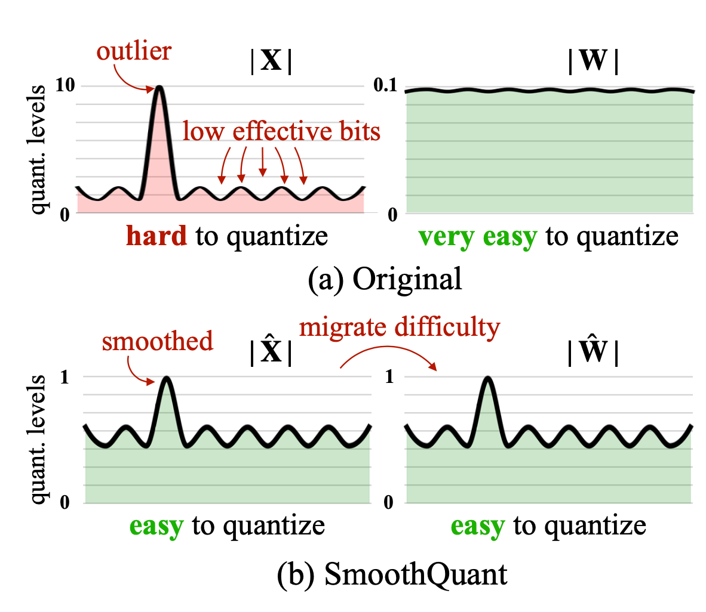
- 通过一个逐通道的量化因子s，我们可以得到新的权重和激活值$$\mathbf{Y} = (\mathbf{X} \text{diag}(\mathbf{s})^{-1}) \cdot (\text{diag}(\mathbf{s}) \mathbf{W}) = \hat{\mathbf{X}} \hat{\mathbf{W}}$$这个因子可以在离线阶段被部署好
- s因子有一个超参数$\alpha$来调控，论文发现$\alpha$取领0.5是一个sweet point，对于激活值变动比较大的模型，可以调大$\alpha$
  $$\mathbf{s} = \max(|\mathbf{X}_j|)^\alpha / \max(|\mathbf{W}_j|)^{1-\alpha}$$
### Quantization-aware training (QAT)（量化感知训练）
- 后训练量化把量化融入了训练或者微调的过程，因此可以得到更好的精度，代价是额外的训练时间和成本
- 一种常用的方法是在微调阶段引入量化，可以使用和预训练相同或者具有代表性的训练集，训练目标可以和原来相同（大语言训练中的NLL/MLM），也可以是针对某个特定的下游任务（分类任务中的交叉熵）
- 另一种方法是把原始模型作为老师，然后把量化后模型作为学生，最小化蒸馏损失。这种方法的好处是不需要原始训练数据，其它的数据就可以（比如维基百科甚至随机token都能得到很好的效果）。LKD（逐层蒸馏）把原始模型作为老师，逐层进行量化。LKD最小化原始权重乘积和量化后权重乘积的MSE。
## Pruning（剪枝）
- 网络蒸馏可以通过修剪掉不需要的参数来减少体积并保持模型性能。它可能需要再训练，也可能不需要。有结构化蒸馏和非结构化蒸馏
  - 非结构化蒸馏：随机的修剪掉一些参数，并不能保持原始模型结构，在硬件上性能可能不太好，实际上不能带来速度提升
  - 结构化蒸馏：保持原始的稠密的矩阵乘积形式，其中有些参数是0。他们要针对硬件支持依照特定的模式，我们这里关注实现Transformer的高稀疏性的结构化剪枝
- 一个常规化的蒸馏流程有三步
  1. 训练一个稠密的网络直到收敛
  2. 对网络进行剪枝，去除无用的网络
  3. 根据需要是否进行再训练
- 认为从一个稠密的网络中剪枝得到一个系数网络依然能保持性能这件事依据了一个彩票假设（LTH），假设认为一个随机初始化，稠密的前向神经网络包含一个神经网络池，而其中只有一个小集合的稀疏神经网络是真正的中奖彩票，单独训练时能达到最佳性能。
### How to prune?
- **Magnitude pruning**直接把很小的权重设置为0。这个方法很粗暴，但很有效。实验表明它可能比一些复杂的数学预算剪枝（variational dropout或l0正则化）还要有效。此外它还易于在大模型上实践，并对超参数不敏感。
- 研究人员发现更大但更稀疏的模型比更小而稠密的模型的效果要好，所以他们提出了**Gradual Magnitude Pruning (GMP)** 来逐渐增加大模型的稀疏性。他们在每一阶段中把绝对值小的值设为0并锁定，不在后续的训练中改变。模型因此会变得越来越稀疏。这个过程对学习率敏感，学习率要比稠密模型的高一点，但也不能太高导致不收敛。
- **Iterative pruning**反复的剪枝，然后再训练，直到达到了目标稀疏程度。
### How to retrain?
- 可以很简单的直接用剪枝后的权重以及预训练数据（或者其他数据）重新训练一遍
- 彩票假设提出了可以进行权重倒带，也就是对于未被剪枝的权重，倒带会之前的权重，然后用同样的学习率训练
- 还可以进行学习率倒带，也就是使用剪枝后的权重，以及一开始的学习率按照原来的计划重新跑一遍。发现他比简单微调和权重倒带往往更有效。
## Sparsity
- 稀疏性是一种有效的方法，能增大模型容量并且保持模型推理效率。这里我们对于Transformer主要有两种方法
  1. 使稠密层变得稀疏，包括自注意力层和FFN
  2. 使结构变得稀疏，比如使用专家模型
### N:M Sparsity via Pruning
- N:M Sparsity是在M个权重中，有N个为0，这可以加速现代硬件的计算，比如英伟达A100支持2:4稀疏性的加速
  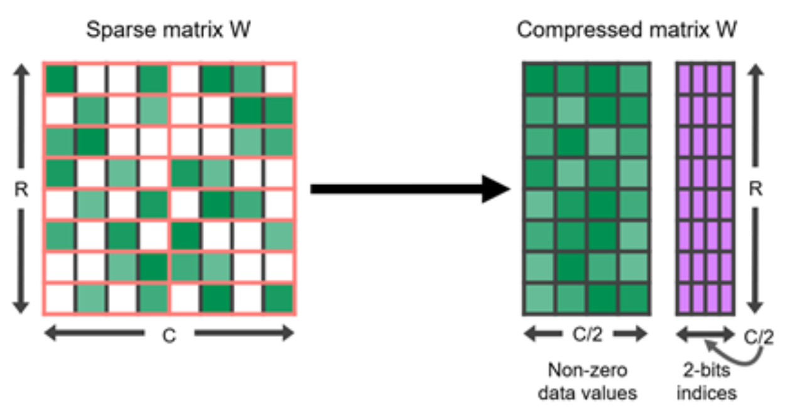
  为了得到N:M Sparsity，英伟达建议一个三步的工作流：训练->蒸馏->再训练
- 对矩阵进行重排可以有效的进行剪枝，当它被要求满足某种限制（比如N:M稀疏），那些重要的参数可以不被剪掉。只要两个矩阵对应的维度做了相同的重排，那么结果就不会被改变
  - 在自注意力层，可以把Q的列向量和$K^T$的行向量进行相同的重排，这样结果并不会改变。
  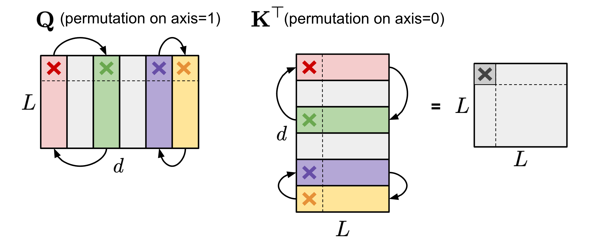
  - 在FFN，通常由两个MLP层和一个非线性ReLU层组成，我们可以对$W_1$的列向量和$W_2$的行向量进行相同顺序的重排，这样也不会影响结果
  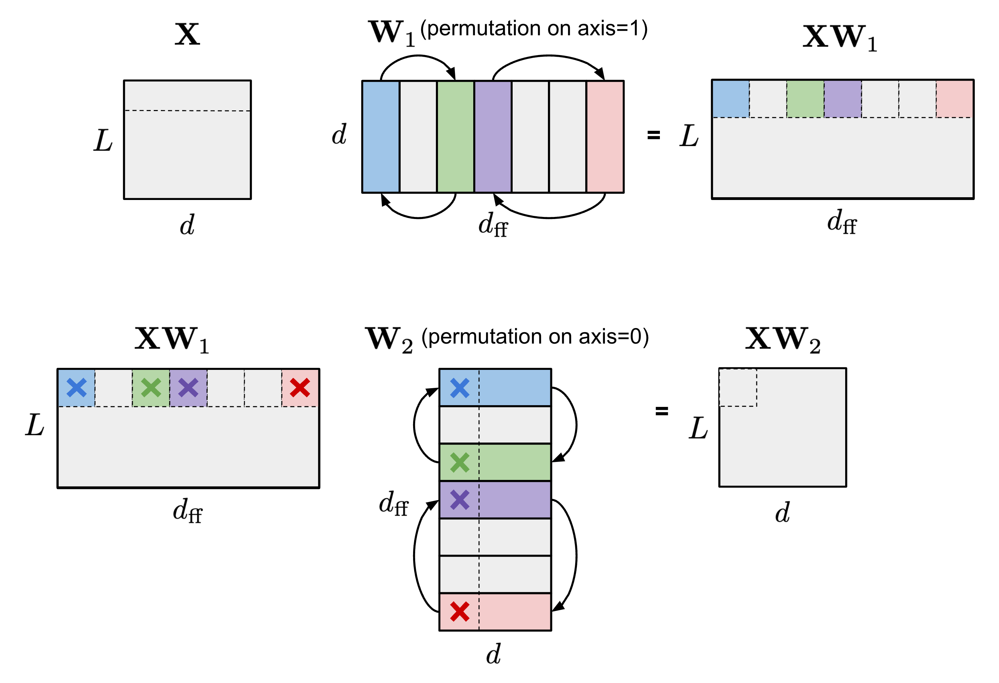
- 为了**加强N:M稀疏性**，我们可以把矩阵的分成一些大小为M的列，我们可以观察到每列内部的顺序以及列的顺序对于N:M稀疏性并没有影响。
  人们提出了一种方法来找到最优排列，使得达到N:M稀疏性时的权重矩阵最大。每一对通道都会被随机的交换，使得权重矩阵更大的被保留，然后进入下一次迭代，但这只能达到局部最优，所以提出了两种方案
  1. 随机交换两个通道，并且搜索次数只为一次交换，这样搜索空间就广而浅
  2. 窄而深的搜索：选择多个条带并且同时优化它们
  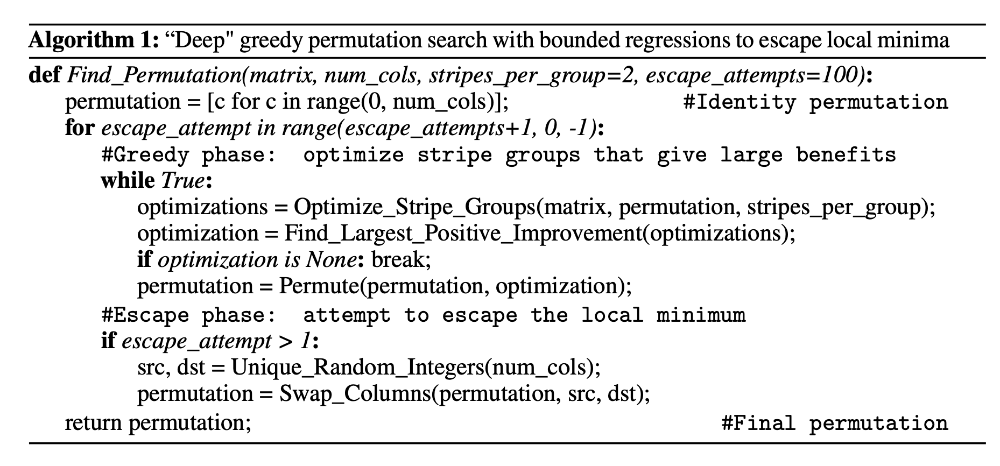

  和用默认顺序进行剪枝相比，如果先使用这种方法再进行剪枝，可以达到较好的效果。
- **STE**常用于反向传播的过程中。在前向传播，STE用稀疏神经网络$\widetilde W$算结果，在反向传播时使用稀疏网络的梯度$\frac{\partial \mathcal{L}}{\partial \widetilde{W}}$作用到稠密网络中，得到$W_{t+1} \leftarrow W_t - \gamma \frac{\partial \mathcal{L}}{\partial \widetilde{W}}$
- **SR-STE**拓展了STE，使用
  $$W_{t+1} \leftarrow W_t - \gamma \frac{\partial \mathcal{L}}{\partial \widetilde{W}} + \lambda_W (\bar{\mathcal{E}} \odot W_t)$$
  其中，$\bar{\mathcal{E}}$ 是 $\widetilde{W}$ 的掩码矩阵（mask matrix），$\odot$ 表示逐元素相乘。这限制了被剪枝的权重并且促进了未被剪枝的权重。
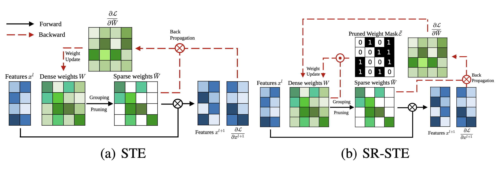
- **Top-KAST**可以在前向和后向传播的过程中都保持稀疏性，而不用像STE一样在前向传播过程中保留稠密的梯度。
  - 在每一个训练步骤 $t$，Top-KAST 的处理流程如下：
    1. 稀疏前向传播 (Sparse forward pass)
     每一层都会根据权重的绝对值大小选择一个参数子集 $A^t \subset \Theta$，该子集包含各层中绝对值最大的前 $K$ 个参数（限制为权重总数的 $D$ 比例）。在时间步 $t$ 的参数化表示 $\alpha^t$ 中，凡是不在 $A^t$（活跃权重）中的参数都会被置为零：$$\alpha_i^t = \begin{cases} \theta_i^t & \text{若 } i \in A^t = \{i \mid \theta_i^t \in \text{TopK}(\theta^t, D)\} \\ 0 & \text{其他情况} \end{cases}$$其中，$\text{TopK}(\theta, x)$ 表示根据权重量级（绝对值大小）从 $\theta$ 中选出比例为 $x$ 的前部权重。
    2. 稀疏反向传播 (Sparse backward pass)随后，将梯度应用到一个更大的参数子集 $B \subset \Theta$ 上，其中 $B$ 包含比例为 $(D + M)$ 的权重，且满足 $A \subset B$。更新更大比例的权重能够更有效地探索不同的剪枝掩码（pruning masks），从而更有可能使前 $D$ 比例的活跃权重发生置换（即让更有潜力的权重脱颖而出）。$$\Delta_{\theta_i^t} = \begin{cases} -\eta \nabla_{\alpha_t} \mathcal{L}(y, x, \alpha^t)_i & \text{若 } i \in B^t = \{i \mid \theta_i^t \in \text{TopK}(\theta^t, D + M)\} \\ 0 & \text{其他情况} \end{cases}$$
  - B/A中额外的元素引入了探索，在训练中探索量会逐渐减小并稳定下来
  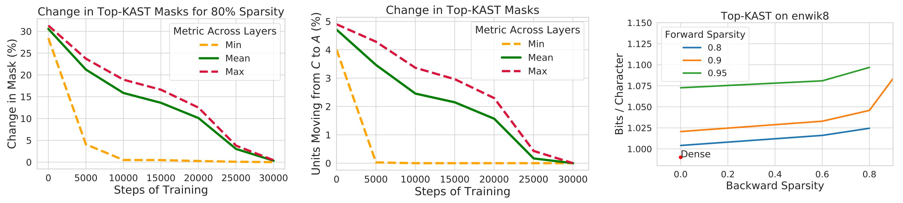
  - 为了防止富者越富，使用l2正则化损失进行惩罚。B\A中的参数惩罚的更多（D是一个比例值，小于1），因为它进入的门槛更高。
  $$L_{\text{penalty}}(\alpha_i^t) = \begin{cases} |\theta_i^t| & \text{若 } i \in A^t \\ |\theta_i^t| / D & \text{若 } i \in B^t \setminus A^t \\ 0 & \text{其他情况} \end{cases}$$
### Sparsified Transformer
- **Scaling Transformer**：把自注意力层和FFN都稀疏化，对于单个实例加速37倍。图为当稀疏化应用于不同层时单个token的处理时间。
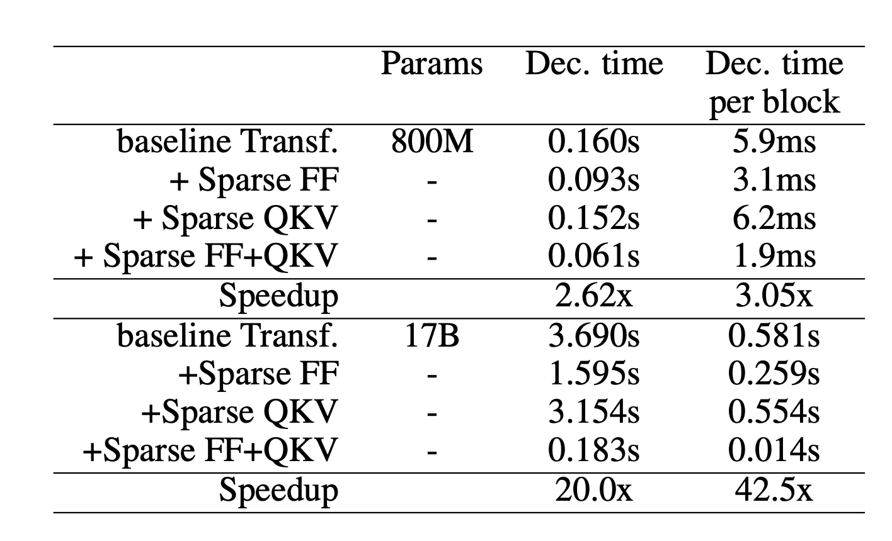
- **Sparse FFN layer**：每个 FFN 层包含 2 个 MLP（多层感知机）以及中间的一个 ReLU 激活函数。由于 ReLU 会引入大量的零值，他们对激活值实施了一种固定结构，以强制在每 $N$ 个元素的块中仅保留 1 个非零值。这种稀疏模式是动态的，针对每个 token各不相同。$$Y_{\text{sparse}} = \max(0, xW_1 + b_1) \odot \text{Controller}(x)$$$$\text{SparseFFN}(x) = Y_{\text{sparse}}W_2 + b_2$$$$\text{Controller}(x) = \arg \max(\text{Reshape}(xC_1C_2, (-1, N)))$$其中，$Y_{\text{sparse}}$ 中的每个激活值对应 $W_1$ 中的一列和 $W_2$ 中的一行。控制器（Controller）实现为一个低秩瓶颈密集层，$C_1 \in \mathbb{R}^{d_{\text{model}} \times d_{\text{lowrank}}}$，$C_2 \in \mathbb{R}^{d_{\text{lowrank}} \times d_{\text{ff}}}$，且 $d_{\text{lowrank}} = d_{\text{model}} / N$。它在推理时使用 $\arg \max$ 来选择哪些列应为非零值，在训练期间则使用 Gumbel-softmax 技巧（Jang et al. 2016）。由于我们可以在加载 FFN 权重矩阵之前计算出 $\text{Controller}(x)$，因此我们知道哪些列将被置零，从而可以选择不将它们加载到内存中，以提高推理速度。
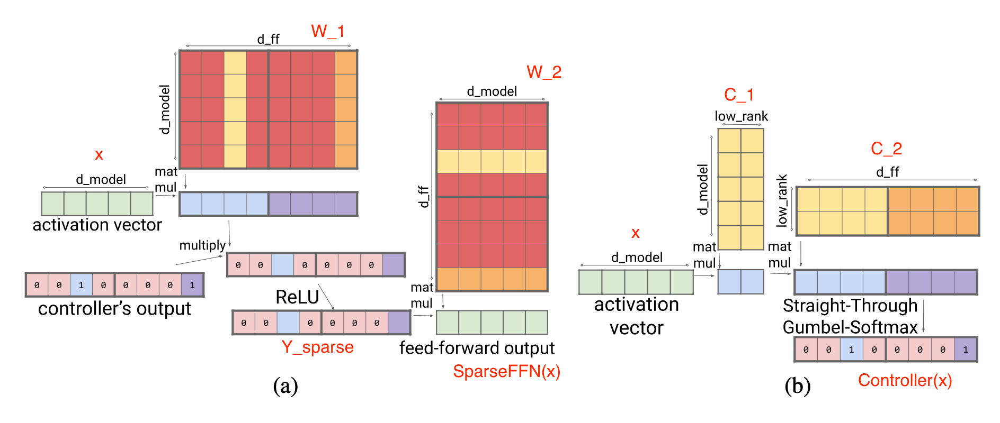

- **Sparse QKV (attention) layer**：在注意力层中，模型维度 $d_{\text{model}}$ 被划分为 $S$ 个模块，每个模块的大小为 $M = d_{\text{model}} / S$。为了确保每个子划分都能访问嵌入向量的任何部分，Scaling Transformer 引入了一个乘法层（（即一个将来自多个神经网络层的输入进行逐元素相乘的层），该层可以表示任意排列，但其参数量比稠密层更少。给定输入向量 $x \in \mathbb{R}^{d_{\text{model}}}$，乘法层的输出为 $y \in \mathbb{R}^{S \times M}$：$$y_{s,m} = \sum_{i} x_i D_{i,s} E_{i,m} \quad \text{其中 } D \in \mathbb{R}^{d_{\text{model}} \times S}, E \in \mathbb{R}^{d_{\text{model}} \times M}$$乘法层的输出是一个大小为 $\mathbb{R}^{\text{batch size} \times \text{length} \times S \times M}$ 的张量。随后，它由一个二维卷积层进行处理，其中序列长度（length）和 $S$ 被视为图像的高度和宽度。这种卷积层进一步减少了注意力层的参数数量和计算时间。
  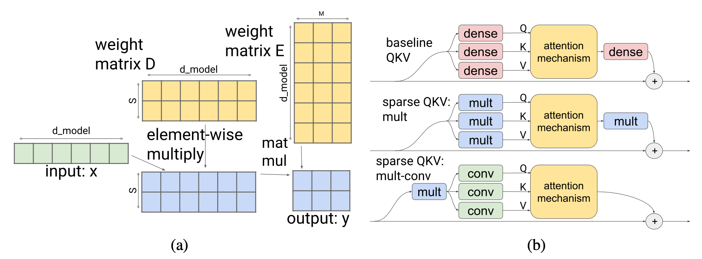
- 为了更好地处理长序列，Scaling Transformer 进一步配备了来自Reformer的LSH（局部敏感哈希）注意力机制以及FFN块循环结构，由此演进成了Terraformer。
### Mixture-of-Experts（
- 混合专家模型（MoE）依赖于一组“专家”网络集合，对于每个输入样本，仅激活其中一部分网络来获取预测结果。这个想法可以追溯到 20 世纪 90 年代（Jacobs et al. 1991），并且与集成学习（Ensemble methods）密切相关。
- 在 MoE 架构中，推理（解码）时仅利用部分参数，因此可以节省推理成本。每个专家的容量可以通过超参数——容量因子（Capacity Factor）$C$ 来调节，专家容量的定义如下：$$\text{专家容量} = \text{round}\left(C \cdot k \cdot \frac{\text{一个批次中的总标记数}}{\text{专家数量}}\right)$$其中，每个标记（Token）会选择前 $k$ 个（top-$k$）专家。较大的 $C$ 会带来更高的专家容量和更好的性能，但计算成本也更高。当 $C > 1$ 时，会增加缓冲容量（Slack Capacity）；反之，当 $C < 1$ 时，路由网络需要忽略掉一部分标记。
#### Routing Strategy Improvement（路由策略改进）
- MoE 层拥有一个路由网络，为每个输入标记（Token）分配一组专家子集。原始（Vanilla）MoE 模型中的路由策略是：按照标记在序列中出现的自然顺序，分别将它们路由到各自首选的专家。如果一个标记被路由到的专家已经达到了其容量上限，该标记将被标记为“溢出”并被跳过。
- **V-MoE**:
  - 将 MoE 层引入了 ViT（视觉 Transformer）。它达到了之前的SoTA性能，但仅需一半的推理计算量。V-MoE 可以扩展到 150 亿参数。他们的实验使用了 $k = 2$（每个标记选 2 个专家）、32 个专家，并且采用了“每隔 2 层放置”的方案（即 MoE 层每隔一层放置一个）。
  - 由于每个专家的容量有限，如果一些重要且信息丰富的标记在预定义的序列顺序中出现得太晚（例如句子中靠后的单词，或图像中靠后的补丁块），它们可能会被迫丢弃。为了避免原始路由方案中的这一缺点，V-MoE 采用了 **BPR**（批次优先级路由，Batch Priority Routing），优先为具有高优先级分数的标记分配专家。BPR 在专家分配前为每个标记计算一个优先级分数（top-$k$ 路由分数的最大值或总和），并据此改变标记的处理顺序。这保证了专家的容量缓冲区会优先被关键标记填满。
  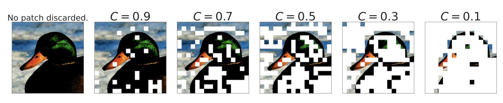
  - 当容量因子 $C \leq 0.5$ 时，BPR的效果远好于原始路由，因为在这种情况下模型会开始丢弃大量的标记。BPR 使模型即使在容量极低的情况下，也能保持与稠密网络相当的竞争力。

- **Task MoE**:
  - Task MoE在机器翻译中考虑了任务信息，并在任务级别（而不是单词或token级别）路由token。他们以多语言神经机器翻译（MNMT）为例，根据目标语言或语言对对翻译任务进行分组。
  - token级路由是动态的，每个标记的路由决策是独立做出的。因此，在推理时，服务器需要预加载所有的专家网络。相比之下，任务级路由在给定固定任务时是静态的，因此针对单一任务的推理服务器只需要预加载 $k$ 个专家（假设采用 top-$k$ 路由）。根据他们的实验，与稠密模型基准相比，Task MoE 可以获得与 Token MoE 相似的性能提升，且峰值吞吐量提高 2.6 倍，解码器大小仅为 1.6%。
  - 任务级 MoE 的本质是根据预定义的启发式规则对任务分布进行分类，并将此类人类知识整合到路由器中。当不存在此类启发式规则时（例如通用的句子续写任务），如何利用 Task MoE 就不那么直观了。
- **PR-MoE**(Pyramid residual MoE)
  - 在研究如何解释“图像类别与专家”之间的关联时，研究人员观察到：早期的 MoE 层通常比较通用，而靠后的 MoE 层则会针对特定的几个图像类别表现出专门的特化
  - PR-MoE 让每个标记（Token）通过一个固定的 MLP（多层感知机）和一个选定的专家。由于观察到 MoE 在后期层更有益，PR-MoE 在后期层采用了更多的专家。DeepSpeed 库实现了一种灵活的多专家、多数据并行机制，使得训练在不同层具有不同数量专家的 PR-MoE 成为可能。
- 总结：目前为止我们看到了MoE进化的三个方向：
  - 路由算法：从“先到先得”变成“按优先级录取”（V-MoE）。
  - 路由粒度：从“逐token路由”变成“按任务路由”（Task MoE），提升了推理速度。
  - 模型架构：从“层层均等”变成“按需分配”（PR-MoE），优化了资源利用率。
#### Kernel Improvement
- 专家网络可以部署在不同的设备上。然而，随着 GPU 数量的增加，每个 GPU 上的专家数量会减少，而专家之间的通信（All-to-all）成本会变得更加昂贵。在大规模部署下，跨 GPU 的专家间全对全通信依赖于 NCCL 的P2P API，但这无法饱和高速链路（如 NVLink, HDR InfiniBand）的带宽，因为随着节点增加，数据块会变得越来越小。现有的All-to-all算法在小工作量的大规模场景下表现不佳。目前有多种算子改进方案来提高 MoE 的计算效率，例如使All-to-all通信更廉价、更快速。
- **DeepSpeed**库和**TUTEL**库都实现了一种基于树的分层All-to-all算法，该算法先进行节点内All-to-all，然后再进行节点间All-to-all。它将通信跳数从 $O(G)$ 降低到了 $O(G_{node} + G/G_{node})$，其中 $G$ 是 GPU 节点的总数，$G_{node}$ 是每个节点的 GPU 核心数。虽然这种实现的通信总量翻了一倍，但它在小批次的大规模扩展中表现更好，因为当批次较小时，瓶颈在于延迟而非通信带宽。
- **DynaMoE** 
  - 使用动态重编译来使计算资源适应专家之间的动态负载，如果专家负载不均，其 `RECOMPILE` 机制会从头开始编译计算图。
  - 它会测量分配给每个专家的样本数量，并动态调整它们的容量因子 $C$，以减少运行时的内存和计算需求。
  - 训练到一定阶段口，基于样本与专家的分配基本会确定，于是直接将其缓存，不再需要门控网络来分配。
## Architectural Optimization
- 由于自注意力机制具有平方级的时间和内存复杂度，这是限制 Transformer 解码效率的主要瓶颈，因此所有高效 Transformer 模型都对原本稠密的注意力层应用了某种形式的稀疏化。这里仅列出一个高层级的概述
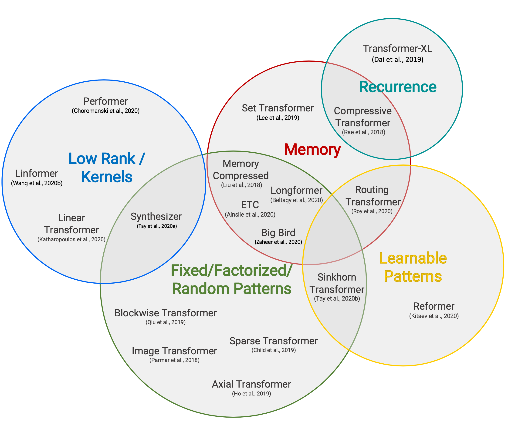
### Sparse Attention Patterns(稀疏注意力模式)
- 固定模式：通过预定义的固定模式限制注意力矩阵的视野。
  - **Blockwise Attention**：将输入序列切分成固定的块。
  - **Image Transformer**：使用局部注意力
  - **Sparse Transformer**：使用跨步注意力模式。
- 组合模式：学习对输入标记进行排序或聚类，在保持固定模式效率优势的同时，获得更优的序列全局视野。
  - **Sparse Transformer**：结合了跨步注意力和局部注意力。
  - **Axial Transformer**：针对高维输入张量，不再对展平后的输入应用注意力，而是沿着输入张量的单个轴应用多次注意力。
  - **ETC, Longformer 和 Big Bird**：结合了局部和全局上下文，以及跨步或随机注意力。
- 可学习模式：通过学习来识别最优的注意力模式。
  - **Reformer**：基于哈希相似度（LSH）将标记聚类。
  - **Routing Transformer**：对标记运行 $k$-means 聚类。
  - **Sinkhorn Sorting Network**：学习对输入序列的块进行排序。
### Recurrence（递归）
- 递归机制通过递归的方式连接多个数据块或分段。
- **Transformer-XL**：通过在不同分段之间重用隐藏状态，实现了对更长上下文的利用。
- **Universal Transformer**：将自注意力机制与 RNN 中的递归机制相结合。
- **Compressive Transformer**：是 Transformer-XL 的扩展，增加了额外的内存。它包含一组用于存储过去激活值的内存槽，以及用于存储压缩激活值的压缩内存槽。每当模型接收到新的输入分段时，主内存中最旧的激活值会被移至压缩内存，并在那里应用压缩函数。
### Memory Saving Designs
- 内存节省设计是指通过改变架构来使用更少的内存。
- **Linformer**：将键（Keys）和值（Values）的长度维度投影到低维表示（从 $N \rightarrow k$），因此内存复杂度从 $N \times N$ 降低到 $N \times k$。
- **Shazeer** (2019)：提出了多查询注意力 (Multi-query attention)，其键（Keys）和值（Values）在不同的注意力头之间共享，大大减小了这些张量的大小和内存成本。
- **随机特征注意力 (Random feature attention) 与 Performer**：使用核方法 (Kernel methods) 来实现自注意力机制的一种更廉价的数学格式。
### Adaptive Attention
- 自适应注意力使模型能够学习最优的注意力范围，或者决定何时针对不同的输入标记进行提前退出。
- **Adaptive Attention Span**：通过在Token与其他键（Keys）之间使用软掩码（Soft mask），训练模型为每个标记的每个注意力头学习最优的注意力范围。
- **Universal Transformer**：引入了递归机制，并利用 ACT (自适应计算时间) 动态决定递归步数。
- **Depth-Adaptive Transformer and CALM**：学习何时根据某些置信度指标为每个标记提前退出计算层，从而实现良好的性能与效率平衡。
## Reference
Weng, Lilian. (Jan 2023). Large Transformer Model Inference Optimization. Lil’Log. https://lilianweng.github.io/posts/2023-01-10-inference-optimization/.