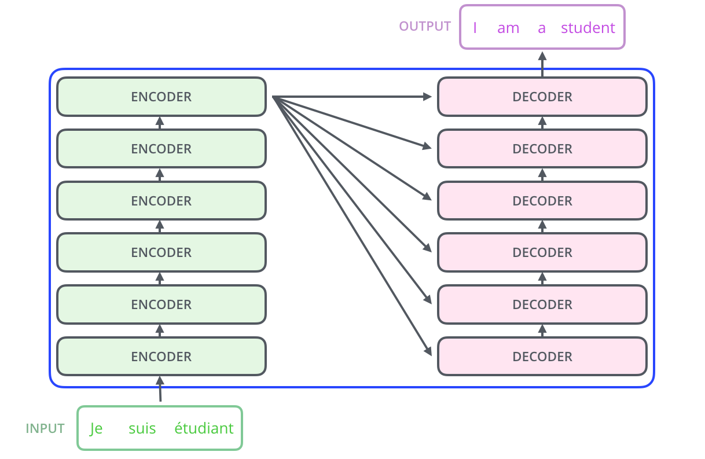
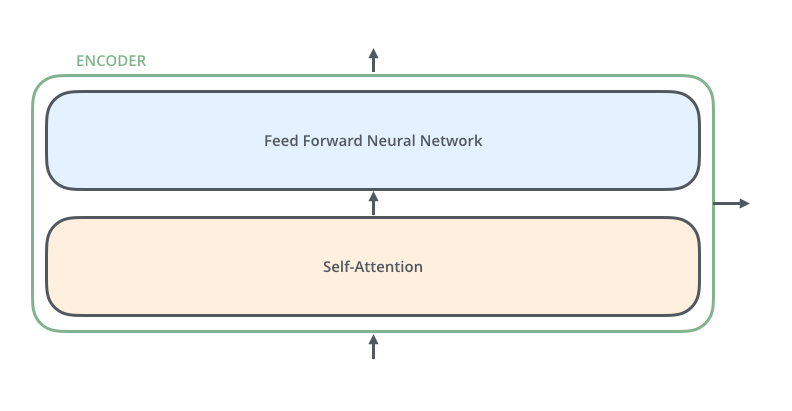
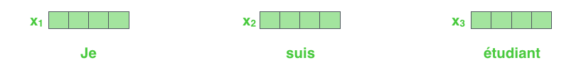
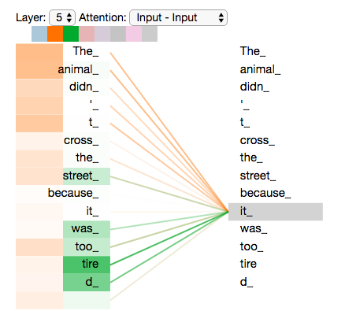
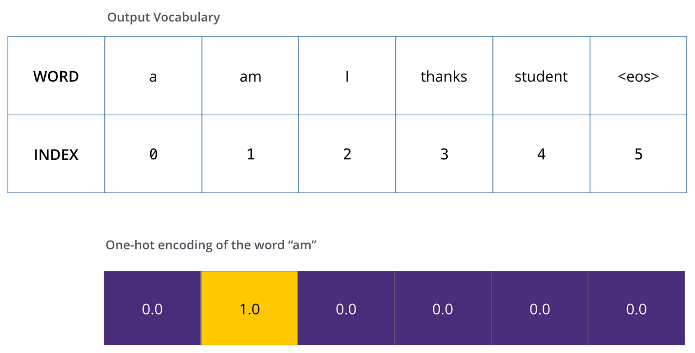

# The Illustrated Transformer
Transformer模型最开始在[Attention is All You Need](https://arxiv.org/abs/1706.03762)中被提出。
## Overview
我们可以先把Transformer看做一个黑箱，那么工作流程就是下图。

打开黑箱，Transformer由编码器，译码器和他们之间的关系组成

编码器是多层编码器的叠加，在原论文中使用六层，不过你想使用多少层都无所谓。解码器的层数和编码器相同。

每个编码器里面都一样，当然它们的权重不一样。每个编码器有两层。第一层是**自注意力层**，它在处理某个词的时候，会关联其它词。自注意力层的结果输入到**前馈神经网络**中，每个位置的前馈神经网络都是相同的。

对于译码器来说，它除了上面两层，还有一个**编码译码注意力层**，他可以注意到输入的相关部分

## 张量
我们已经了解了Transformer的总体布局，那让我们来看看不同的向量和张量是如何在神经网络里流转的。
和一般的NLP一样，我们先使用嵌入算法把每个输入转化为向量

嵌入只在最底层的编码器中发生。每层编码器都获得一列向量，每个向量的大小是512。在最底层，编码器获得的是单词嵌入。而在其他层，编码器获得的是上一层的输出。列表的大小事我们可以设置的超参数，一般来说是训练数据集中最长的句子的单词数。当词成为嵌入后，每个词都流过编码器的两层。

Transformer的特征就是每个单词都独立流向编码器，他们之间的联系有自注意力层体现，而前馈层是完全独立的，因此当流经前馈层的时候，不同的路径可以并行执行
## 编码
接下来让我们看看每一层编码器里面发生了什么。编码器接受一列向量作为输入，然后把向量传递到自注意力层，然后传输到前馈神经网络网络，输出再传入下一层编码器

## 自注意力
### 什么是自注意力
拿一个句子举例：我爱吃苹果，它很甜。
自注意力层在处理“它”的时候就会关联到“苹果”

### 自注意力的机制
- 第一步是要从每个输入嵌入中得到三个向量。对于每个输入嵌入，我们把它乘以三个矩阵，就可以得到Query，Keys，Values向量，三个矩阵的值是我们在训练过程中算出来的。三个向量一般比嵌入要小，向量大小一般是64，嵌入是512。大小不一定要更小，这只是一个工程上的选择，让多头注意力的计算保持一致。在数学上，这叫线性投影，公式通常表示为 $X W^Q, X W^K, X W^V$

- 第二步是计算一个分数。对于一个词，我们要对这句话里的其他词计算出关于这个词的分数，这能告诉我们在编码这个词的时候，应该关注多少其它的词。这个分数是由Query向量和Key向量点积得到的。比如我们在计算位置1的分数，第一个分数就是Q1·K1，第二个分数是Q1·K2。公式就是$QK^T$

- 第三步和第四步是把计算出来的分数除以8（8是K向量大小的平方根，在论文中使用64。这个数值可以让梯度更稳定，当然这个数字可以改变，而8是默认值）。然后结果会传入一个softmax操作，这可以正态化分数，让它们都是正数并且相加等于1.公式就是$\text{Softmax}\left(\frac{...}{\sqrt{d_k}}\right)$

算出来的softmax分数表示了这个词和其他词的关联程度，当然它和自己的关联程度是最高的，然而有时关注其它词也是有用的。
- 第五步是把Value向量乘以软阈值（为了之后求和）。动机是保留我们关注的Value向量，并把无用的单词扔掉（通过乘以一个很小的数）。第六步是把加权Value向量加起来，这就得到了这一层编码器对于这个词的输出。这就是公式里面的$\times V$
  
- 因此，Attention的公式可以总结为$$ \text{Attention}(Q, K, V) = \text{Softmax}\left(\frac{QK^T}{\sqrt{d_k}}\right)V $$
### 自注意力机制的矩阵乘法
1. 计算Q，K，V向量。我们的嵌入是X，然后把它乘以我们训练得到的矩阵$W^Q,W^K,W^V$.X矩阵的每一行代表一个词
 
2. 然后使用这个公式计算出结果

## 多头注意力
它有以下两个优点：
- 它能够关注到不同位置的单词。在上述的例子中，Z1包含了各个单词，但依然被自己这个词所主导。如果我们在翻译“苹果很甜，我爱吃它”的时候，“它”这个词指向什么非常重要。、
- 它给了注意力层多个表征子空间。多头注意力不只有一个，而有多个Q，K，V向量的集合（Transformer使用了8个注意力头，所以有8个集合）。每个集合是随机初始化的。在训练后，每个集合可以被用来把输入嵌入映射到不同的表征子空间中。

如果我们做相同的自注意力操作，那我们就会得到8个Z矩阵
  
但是前馈层只接受一个矩阵，所以我们要把八个矩阵压缩成一个矩阵。我们把八个矩阵聚合，然后乘以一个矩阵$W^O$

让我们用一张图来表示它

让我们回到之前的例子，看一下不同的注意力层是怎么工作的

如果我们把全部注意力头放入，那么结果就是这样：

## 使用位置编码来代表序列顺序
到目前为止，我们还没有讨论如何考虑输入序列的位置关系。为了解决这个问题，Transformer在每个嵌入中增加了一个向量，这个向量按照模型学到的特定模式展现单词的位置。这使得不同的嵌入向量在映射到QKV向量或者点积注意力时能够保持一定的距离。

如果我们默认嵌入是四维的，那么位置编码看起来像这样：

他可以由下图来形象地表示，其中每行就是一个位置编码，它的大小是512.图中被分成了两半，因为左边是由一个函数计算得到的，右边是由另一个函数计算得到的，他们被拼起来了。

论文中有位置编码的计算方式，这不是唯一的方式，但这个方式能够处理之前未见过的长度序列（比如比训练集中的所有序列都要长）
在Tensor2Tensor的实现中，他使用了一种新方式。这里位置编码不是被简单拼接，而是交织起来。

## The Residentials
编码器的每层（self-attention和ffnn）后都有一个残留连接，还有一个层正则化步骤

我们可以这么图形化表示层正则化步骤：

对于解码器来说，也是一样的

## 解码器部分
最高层编码器的输出被转化为KV向量的集合，被每个encoder-decoder attention所利用，这可以帮助解码器关注输入序列的特定位置。

接下来这些步骤被重复，直到达到了一个特定的标志表明解码器工作完成，解码器就像和编码器一样累加他们的向量，并且会增加一个位置编码信息。

在**自注意力层**，解码器只关注前面的单词。它通过将后面的单词在自注意力计算的softmax步骤前设置为-INF来实现。
**Encoder-Decoder Attention**和多头注意力有点像，只不过它从它下面的层创造Q向量，并且从编码器获得KV向量
在**最后的线性和Softmax层**，译码器输出一个浮点数序列，然后线性层把这个向量投影成为一个很大的向量，成为**logits vector**。如果我们知道10000个单词库，那么logits vector就包含10000块，每一块表示特定词的分数，然后我们再用softmax层把它转化为概率，概率最大的词成为输出。

## 训练概述
### 独热编码
在训练过程中，我们的输入经过相同的前向过程，不过我们会将它的输出和正确答案作比较，不妨假设只有6个单词

知道了单词库后，我们就可以用相同大小的向量来表示这个单词，这也被称为**独热编码**，比如我们可以把am用下列向量表示

### 损失函数
拿一个简单的例子来讲，我们现在希望merci这个词的输出是thanks，我们把输出和答案相比较，然后使用反向传播来改变模型的权重。

如何比较两个概率分布的优劣？我们直接把它们相减。一般来说，我们的输入是一个更长的句子比如“je suis étudiant”，我们希望输出是“i am a student”，因为我们希望模型正确的输出像这样的权重分布：
- 每个概率分布有一个单词库大小的向量表示
- 第一个向量分布在i处取到最大值
- 第二个向量分布在am处取到最大值
- 直到第五个向量分布在`<end of sentence>`处取到最大值

我们的目标模型输出是这样的：
 
我们希望训练得到的模型输出是这样的：
由于模型一次输出一份，因此我们可以选概率最高的作为答案，这叫**greedy decoding**。
还有一种方法是对第一个词，选择概率最高的两个词，然后认为第一个词分别是这两个词，重新跑一遍，误差更小的那个作为答案。然后对第二个词，第三个词重复这个过程。这叫**beam search**。在这里我们的beam_size取2，因为我们永远保留两种可能方案。我们的top_beams也是2，因为我们给出了两种翻译。这都是可以调节的超参数。

## Reference
https://jalammar.github.io/illustrated-transformer/
